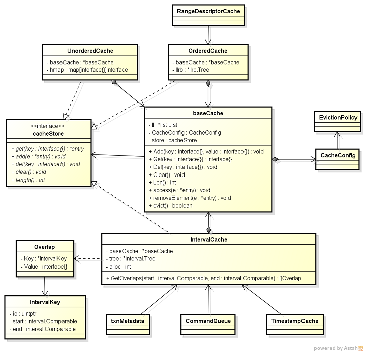

---
layout: post
category: "code analysis"
title:  "Cockroach Cache Mechanism"
tags: [Cockroach, Cache]
---

### Cockroach中的Cache层次结构



下面是一段IntervalCache的示例代码
```go
func TestIntervalCacheOverlap(t *testing.T) {
	ic := NewIntervalCache(CacheConfig{Policy: CacheLRU, ShouldEvict: noEviction})
	ic.Add(ic.NewKey(rangeKey("a"), rangeKey("c")), 1)
	ic.Add(ic.NewKey(rangeKey("c"), rangeKey("e")), 2)
	ic.Add(ic.NewKey(rangeKey("b"), rangeKey("g")), 3)
	ic.Add(ic.NewKey(rangeKey("d"), rangeKey("e")), 4)
	ic.Add(ic.NewKey(rangeKey("b"), rangeKey("d")), 5)
	ic.Add(ic.NewKey(rangeKey("e"), rangeKey("g")), 6)
	ic.Add(ic.NewKey(rangeKey("f"), rangeKey("i")), 7)
	ic.Add(ic.NewKey(rangeKey("g"), rangeKey("i")), 8)
	ic.Add(ic.NewKey(rangeKey("f"), rangeKey("h")), 9)
	ic.Add(ic.NewKey(rangeKey("i"), rangeKey("j")), 10)

	expValues := []interface{}{3, 2, 4, 6, 7, 9}
	values := []interface{}{}
	for _, o := range ic.GetOverlaps(rangeKey("d"), rangeKey("g")) {
		values = append(values, o.Value)
	}
	if !reflect.DeepEqual(expValues, values) {
		t.Errorf("expected overlap values %+v, got %+v", expValues, values)
	}
}
```

